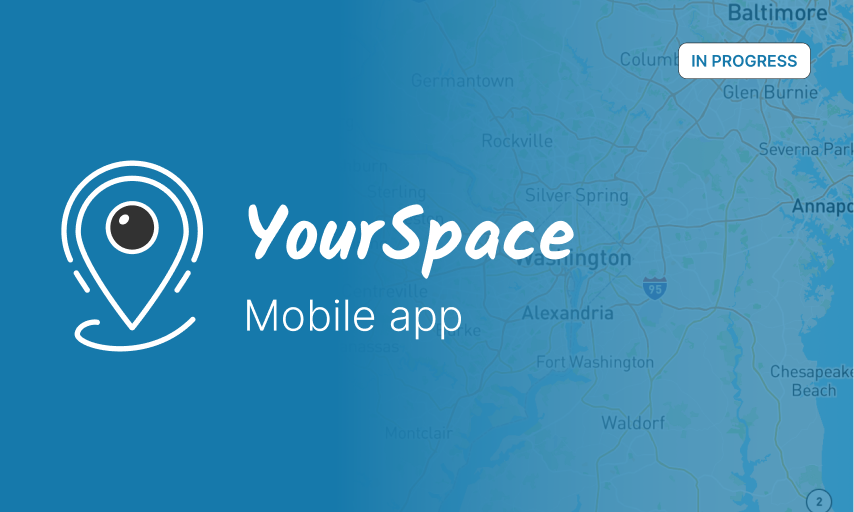

<p align="center"> <a href="https://canopas.com/contact"></a></p>

# YourSpace - Stay connected, Anywhere!
Enhancing family safety and communication with real-time location sharing and modern UIs.




## Overview
Welcome to YourSpace, an open-source Flutter application designed to enhance family safety through real-time location sharing and communication features. YourSpace aims to provide peace of mind by ensuring the safety of your loved ones while facilitating seamless communication regardless of their location.

YourSpace adopts a declarative UI approach with Flutter and utilizes flutter_riverpod for state management. This architecture promotes a clear separation of concerns, making the codebase more maintainable, scalable, and testable. Flutter’s widget-based system allows for the creation of highly responsive UIs, while flutter_riverpod ensures efficient state handling across different components, leading to a smooth and intuitive user experience.

## Download App
<a href="https://play.google.com/store/apps/details?id=com.canopas.yourspace"></img></a>


## Features
YourSpace is currently in active development 🚧, with plans to incorporate additional features shortly.

YourSpace ensures your loved ones' well-being with:

- [X] Real-time Location Sharing
- Secure Communication
- Geo-fencing
- Real-time Alerts
- Check-Ins
- SOS Help Alert

## Screenshots

<table>
  <tr>
  <th width="33%" >Create/Join Space</th>
  <th  width="33%" >Share Location</th>
   <th  width="33%" >Location History</th>
  </tr>
    <tr>
  <td></td>
  <td>  </td>
  <td>  </td>
  </tr>  
</table>

## Requirements
Make sure you have the latest stable version of Android Studio installed.
You can then proceed by either cloning this repository or importing the project directly into Android Studio, following the steps provided in the [documentation](https://developer.android.com/jetpack/compose/setup#sample).
<details>
     <summary> Click to expand </summary>

### Google Maps SDK
To enable the MapView functionality, obtaining an API key as instructed in the [documentation](https://developers.google.com/maps/documentation/android-sdk/get-api-key) is required. This key should then be included in the local.properties for android and Info.plist for ios file as follows:

Android:
```
MAPS_API_KEY=your_map_api_key
```

IOS:
```
MAPS_API_KEY=your_map_api_key
```

## Add config.dart
Inside the `data/lib` directory, create a new file named `config.dart`. This file will store your place API key, follow format:
```
class AppConfig {
  static const String placeApiKey = 'YOUR PLACE API KEY';
}
```

### Firebase Setup
To enable Firebase services, you will need to create a new project in the [Firebase Console](https://console.firebase.google.com/).
Use the `applicationId` value specified in the `app/build.gradle` file of the app as the Android package name.
Once the project is created, you will need to add the `google-services.json` file to the `android/app` module for android and `ios/Runner` module for IOS.
For more information, refer to the [Firebase documentation](https://firebase.google.com/docs/flutter/setup?platform=android).

YourSpace uses the following Firebase services, Make sure you enable them in your Firebase project:
- Authentication (Phone, Google, Apple)
- Firestore (To store user data)
</details>

## Tech stack

YourSpace utilizes the latest Flutter technologies and adheres to industry best practices. Below is the current tech stack used in the development process:

- State Management: flutter_riverpod
- Declarative UI: Flutter Widgets
- Language: Dart
- Asynchronous Programming: async + Stream
- Navigation: go_router
- Persistent Storage: SharedPreferences, SQLite

## Contribution
Currently, we are not accepting any contributions.

## Credits
YourSpace is owned and maintained by the [Canopas team](https://canopas.com/). You can follow them on Twitter at [@canopassoftware](https://twitter.com/canopassoftware) for project updates and releases. If you are interested in building apps or designing products, please let us know. We'd love to hear from you!

<a href="https://canopas.com/contact"></a>

## License

YourSpace is licensed under the Apache License, Version 2.0.

```
Copyright 2024 Canopas Software LLP

Licensed under the Apache License, Version 2.0 (the "License");
You won't be using this file except in compliance with the License.
You may obtain a copy of the License at

   http://www.apache.org/licenses/LICENSE-2.0

Unless required by applicable law or agreed to in writing, software
distributed under the License is distributed on an "AS IS" BASIS,
WITHOUT WARRANTIES OR CONDITIONS OF ANY KIND, either express or implied.
See the License for the specific language governing permissions and
limitations under the License.
```
